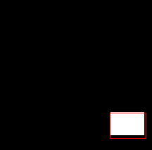

# Image-Object-Localization
This is a Object Localization problem in which we find what the object is in the image(image classification) and where the object is present in the image and draw bounding boxes(Object Localization).It involves both classification and regression problems.
  

**Image Classification**: Predict the type or class of an object in an image.
 Input: An image with a single object, such as a photograph.
 Output: A class label (e.g. one or more integers that are mapped to class labels).
  **Object Localization**: Locate the presence of objects in an image and indicate their location with a bounding box.
 Input: An image with one or more objects, such as a photograph.
 Output: One or more bounding boxes (e.g. defined by a point, width, and height).
  **Object Detection**: Locate the presence of objects with a bounding box and types or classes of the located objects in an image.
 Input: An image with one or more objects, such as a photograph.
 Output: One or more bounding boxes (e.g. defined by a point, width, and height), and a class label for each bounding box

    

Here I used custom dataset for finding bounding boxes for an object.

  
In our first example, we did what is quite possibly the simplest thing possible, localize a **white box on a black background**
  
And our second example, we started using a real object, **an image of Charmander(pokemon)**.
  
And our third example, we resize the object so that our network would be able to find **objects of different sizes**.
  
In the fourth example, we flip the objects so that our network would be able to find the **same object at different orientations** and uses resizing,flip,rotation,different contrast,brightness and other image trasformation techniques.
  
And our fifth example, we added **real background to the image**, since in real applications, images can have many objects in them, not all relevant.
  
In our six example, we considered the case **where the objects need not appear**, which of course is alsomore realistic.
  
In seventnh example, we are going to consider the case where we have **multiple classes of objects** (Pokemons), so,for example, in a self-driving application, you will have to recognize people, traffic signs, cars,bicycles and so forth.
  
We know that for the three classes we would like to apply the softmax activation and for the other five we use sigmoid activation and custom loss function using Binary cross entropy and Categorical cross entropy.

   

  

  

  

  

  

  

  

